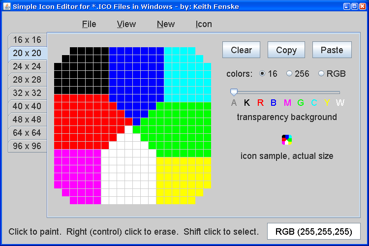

### Icon Editor (Java)

by: Keith Fenske, https://kwfenske.github.io/

IconEdit is a Java 1.4 graphical (GUI) application to edit icon files for
Windows. An icon file has several images in sizes like 16x16, 24x24, 32x32,
48x48, and 64x64 pixels. Icons are square from 8x8 to 256x256 pixels. Colors
may be 4-bit (16 colors), 8-bit (256 colors), or 24-bit (millions). Pixels may
be transparent and let the background show through. Please note that IconEdit
is an old program and does not support alpha channels, compressed data (PNG
images), or icons larger than 256 pixels.

Download the ZIP file here: https://kwfenske.github.io/icon-editor-java.zip

Released under the terms and conditions of the Apache License (version 2.0 or
later) and/or the GNU General Public License (GPL, version 2 or later).

